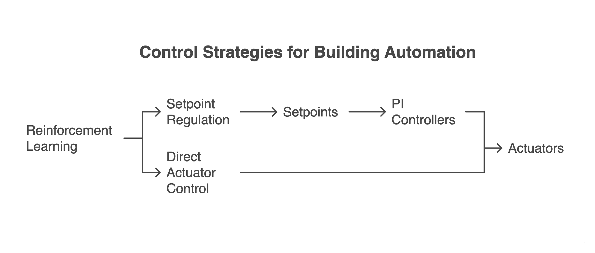
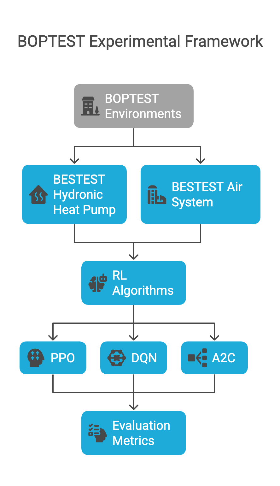
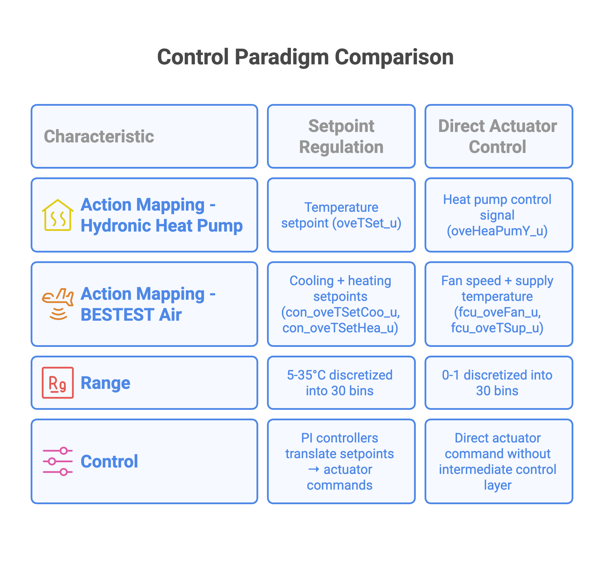
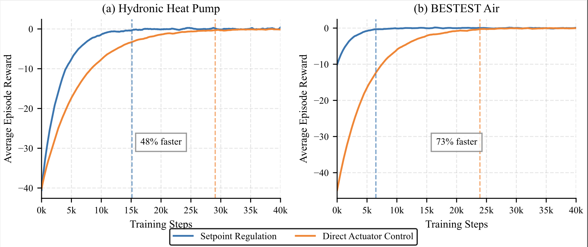
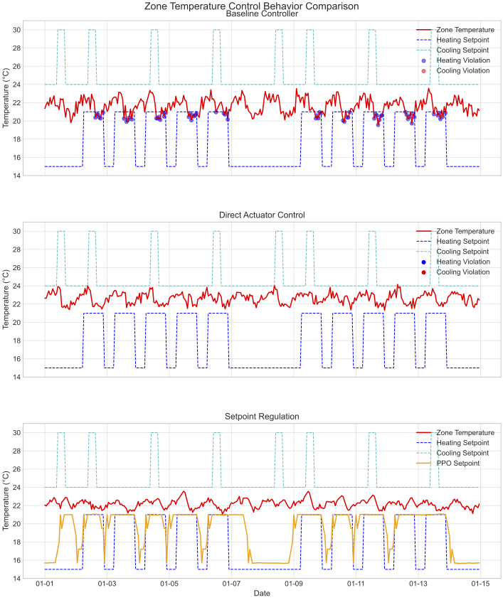

<!-- _class: title-slide -->

# Reinforcement Learning for Building Control: Direct Actuator or PI-Mediated Control?

## A Systematic Comparison Using BOPTEST Framework

**Aniket Dixit**, Faizan Ahmed, James Brusey  
Coventry University, UK

**E-ENERGY '25**  
June 17–20, 2025, Rotterdam, Netherlands

---

## Why This Matters

- **40% of global energy consumption** comes from buildings
- Traditional PI controllers **lack predictive capabilities** for optimal energy-comfort trade-offs
- Reinforcement Learning shows promise but lacks systematic evaluation

## Current Research Gap

- Most studies focus on **single control paradigm**
- Limited **empirical comparisons** between approaches
- Lack of **standardized evaluation** across building types

<strong>Fundamental Question:</strong> Should RL agents control setpoints or directly command actuators?

---

# Two Control Paradigms

Setpoint Regulation (SR) vs Direct Actuator Control (DAC) architecture

<!-- 

<strong>Key Question:</strong> Hierarchical control through setpoints vs. direct actuator commands?

 -->

---

## Setpoint Regulation (SR)
- Stable, proven architecture
- Leverages existing building automation
- Preserves low-level control expertise
- Built-in safety mechanisms
- Easier integration

## Direct Actuator Control (DAC)
- Larger solution space
- No cascading errors
- Full control authority
- Potentially optimal strategies
- Direct optimization

<strong>Research Challenge:</strong> Which approach offers better training efficiency, control stability, and energy performance in realistic building scenarios?

---

# Research Questions

- **Energy Efficiency**: How do trade-offs differ between approaches across building types?

- **Thermal Comfort**: What are the comfort achievement and violation patterns?

- **Training Efficiency**: Which approach converges faster and requires fewer samples?

- **Control Stability**: How does operational robustness compare between paradigms?

<strong>Goal:</strong> Provide quantitative evidence to guide practical RL deployment in real-world building control systems

---

<!-- _class: section-divider -->

# Methodology

---

# Experimental Framework

**BESTEST Hydronic Heat Pump**
- Single-zone residential building
- Heat pump + radiant floor heating
- Complex thermal dynamics

**BESTEST Air System**
- Variable air volume HVAC
- Heating and cooling coils
- Fast-response system

Experimental Framework

---

## Reinforcement Learning Formulation

**State Space:** Zone temperature, weather conditions, time features, electricity pricing

**Action Space:** 30-bin discretization for fair comparison

**Reward Function:**
$$R_t = -(O_t - O_{t-1})$$
$$\text{where } O_t = \text{cost\_tot} + \text{tdis\_tot}$$

---

# Control Paradigm Implementation

#### Both paradigms use identical:
- **State spaces**: Zone temperature, weather, time features
- **Training protocols**: 10M steps, 1-hour control periods
- **Evaluation metrics**: Energy cost, thermal comfort, training efficiency

#### Key Differences
- SR: Temperature setpoints (5-35°C)
- DAC: Direct actuator commands (0-1 range)

Control Paradigm Implementation

---

<!-- # Baseline Controllers

## PI Controller Formulations

**Hydronic Heat Pump Baseline:**
$$u_{HP} = K_p \cdot \varepsilon + K_i \cdot \int \varepsilon \, dt, \quad 0 \leq u_{HP} \leq 1$$

where $\varepsilon = T_{set} - T_{zone}$ and setpoint varies by occupancy:

$$T_{set} = \begin{cases} 
T_{heat} + 0.2°C & \text{if occupied} \\
T_{heat} + 5.5°C & \text{if unoccupied}
\end{cases}$$

**BESTEST Air Baseline:**
- Separate PI controllers for heating/cooling
- Supply air temperature and fan speed modulation
- Binary equipment operation based on demand

--- -->

<!-- _class: section-divider -->

# Results

---

## Energy vs. Comfort Trade-offs

| Environment | Method | Energy Cost | Thermal Discomfort | Improvement |
|-------------|--------|-------------|-------------------|-------------|
| **Hydronic Heat Pump** | SR | 0.924 (+4.8%) | 0.00 (-100%) | Perfect comfort |
| | DAC | 0.898 (+1.8%) | 1.63 (-80.6%) | Balanced |
| | Baseline | 0.882 |  8.38 Kh  |  Poor comfort |
| **BESTEST Air** | SR | 0.210 (+5.0%) | (0.04) -99.3% | Near-perfect |
| | DAC | 0.206 (+3.2%) |  1.09 (-80.8%) | Efficient |
| | Baseline | 0.200 | 5.69 Kh | Poor comfort |

<strong>Key Finding:</strong> Consistent pattern across building types - SR prioritizes comfort, DAC balances energy-comfort trade-offs

---
## Training Efficiency Comparison

| Method | SR Steps | DAC Steps | Improvement |
|--------|----------|-----------|-------------|
| **PPO (Hydronic)** | 8,200 | 15,800 | **48% faster** |
| **PPO (Air)** | 6,800 | 25,200 | **73% faster** |
| **DQN (Hydronic)** | 7,500 | 18,700 | **60% faster** |
| **DQN (Air)** | 7,200 | 24,500 | **66% faster** |
| **A2C (Hydronic)** | 6,900 | 16,200 | **61% faster** |
| **A2C (Air)** | 5,900 | 28,100 | **79% faster** |

Control Paradigm Implementation

---

# Control Stability Analysis

| Metric | SR | DAC | Baseline |
|--------|----|----|----------|
| **Control Variance** | -38% | +34% | 0% |
| **Cycles/Day** | 3.9 | 6.3 | 4.7 |
| **Stability** | Best | worst | Frequent |

## Key Findings

- **Superior stability**: 38% lower control variance
- **Reduced cycling**: Extends equipment life
- **Perfect comfort**: Maintains temperature band
- **Operational efficiency**: More stable behavior

---

# Why Setpoint Regulation Excels

### 1. **Incorporates System Knowledge**
Pre-existing PI controllers encode thermal response characteristics through tuned parameters (Kp, Ki), providing useful inductive biases for learning

### 2. **Structured Optimization Problem**
Clearer action-response relationships with constrained, reasonable setpoint ranges create smoother reward landscapes

<!-- ### 3. **Noise Filtering**
Low-level controllers filter high-frequency disturbances, enabling more stable learning dynamics -->

<strong>Result:</strong> 48-79% reduction in training steps across algorithms and environments, with 38% lower control signal variance

---

<!-- _class: section-divider -->

# Discussion & Impact

---

## Technical Innovations

- **First systematic comparison** of SR vs DAC in building control
- **Standardized evaluation** using BOPTEST framework across building types
- **Quantitative training efficiency analysis** with consistent methodology

## Practical Insights

### When to Choose SR
- **Comfort-critical applications**
- **Limited training data/time**
- **Existing building automation**
- **Risk-averse deployments**

### When to Consider DAC
- **Energy-focused objectives**
- **New system installations**
- **Research/experimental settings**
- **Specialized control requirements**

---

# Limitations & Future Work

### Current Study Limitations

- **Simulation-based evaluation** may not capture all real-world complexities
- **Constant electricity pricing** - dynamic pricing effects unexplored
- **Fixed comfort-energy weighting** in reward function
- **Single-zone buildings** - multi-zone coordination unexplored

### Future Research Directions

- **Hybrid approaches**: Dynamic switching between SR and DAC based on conditions
- **Multi-zone systems**: Coordination challenges in larger buildings
- **Real-world validation**: Pilot deployments in actual buildings
- **Transfer learning**: Cross-building knowledge transfer

---

# Conclusion

### Training Efficiency Champion: Setpoint Regulation
**48-79% fewer training steps** across all algorithms and environments, with superior control stability (38% lower variance)

### Control Stability and Performance Pattern
**SR**: Superior stability with 38% lower control variance and 3.9 cycles/day vs 6.3 for DAC  
**DAC**: Higher control variance but direct optimization capability with 1.8-3.2% energy increases

### Algorithm Winner: A2C
Consistently fastest convergence and best performance across both control paradigms

---

<!-- _class: title-slide -->

# Thank You

## Questions & Discussion

**Contact Information:**  
📧 dixita4@uni.coventry.ac.uk  
🏛️ Coventry University, UK  
📄 DOI: 10.1145/3679240.3734670

<!-- **Key Resources:**  
🔬 BOPTEST Framework: Available for reproducible research  
📊 Complete experimental data and analysis  
🏢 Implications for building automation industry -->

<!-- --- -->

<!-- # Backup Slides

## Detailed Performance Metrics

**Extended Performance Analysis**
[Insert Figure 3 from appendix showing detailed heat pump performance metrics including on-time, comfort violations, and cycling behavior]

### Equipment Impact Analysis
- **Reduced cycling frequency**: SR requires 3.9 cycles/day vs 6.3 for DAC
- **Extended equipment life**: Lower cycling reduces mechanical wear
- **Energy distribution**: 85.4% heat pump utilization with perfect comfort

---

# Technical Implementation Details

## Experimental Protocol

**Training Configuration:**
- 10 million steps per experiment
- 1-hour control periods
- 14-day evaluation periods
- Multiple random seeds for statistical validity

**BOPTEST Integration:**
- Standardized building models
- Consistent observation spaces (280-310K temperature range)
- Weather data integration (265-303K outdoor, 0-862 W/m² solar)
- Real-time performance metrics

## Reward Function Design

$$R_t = -(O_t - O_{t-1})$$
$$O_t = \text{cost\_tot} + \text{tdis\_tot}$$

**Benefits**: Direct optimization of combined objective, encourages step-wise improvement -->